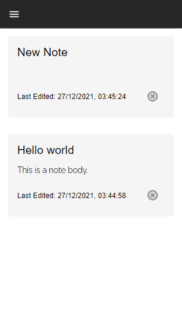

[](https://github.com/Debarshi95/letsnote/actions)

# LetsNote

A React JS mobile responsive web app for making and your managing notes.

## Demo

[Deployed on Netlify using github actions](https://letsnote-debarshib.netlify.app)

## Built using:

- [ReactJS](https://reactjs.org) - Frontend framework
- [React Router](https://reactrouter.com) - For routing & navigation
- [Material UI](https://mui.com) - For UI styles.
- [Redux-Toolkit](https://redux-toolkit.js.org) - Centralized state management library
- [Firebase](https://firebase.google.com) - serves as backend to store data and authentication
- [React-Hot-Toast](https://react-hot-toast.com) - to show Toast Notifications
- [React-Quill](https://zenoamaro.github.io/react-quill) - a rich text editor

## Features:

- Authentication facility for new users
- Registered user can create new note
- Registered user can update existing note
- Timestamp of each note
- Deleting notes
- Uses Redux Toolkit for centralized state management
- LazyLoading/Code-splitting of components to dynamically load at runtime
- Loading Spinner when fetching data
- Responsive UI for all screens (Desktop, Tablet, Mobile)

## Screenshots

#### Desktop


<br/>

#### Mobile

<br/>
<div align="center">




</div>

## Run Locally

- Clone the project
  `git clone https://github.com/Debarshi95/LetsNote.git`
- Go to the project directory
- cd letsnote
- Install dependencies
  `yarn`
- Create a **.env** file
- Create a project inside Google Firebase and export the configuration
- Add the following configuration to your .env file

```
REACT_APP_API_KEY="<Firebase API_KEY>"
REACT_APP_AUTH_DOMAIN="<Firebase AUTH_DOMAIN>"
REACT_APP_PROJECT_ID="<Firebase PROJECT_ID>"
REACT_APP_STORAGE_BUCKET="<Firebase STORAGE_BUCKET>"
REACT_APP_MESSAGING_SENDER_ID="<Firebase MESSAGING_SENDER_ID>"
REACT_APP_APP_ID="<Firebase APP_ID>"
```

- Start the server
  `yarn start`

## License

[MIT](LICENSE)
